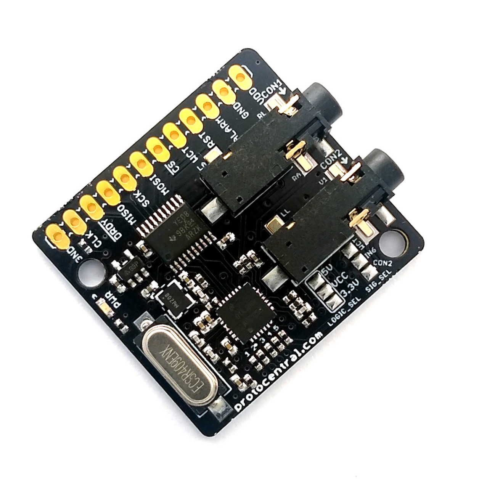
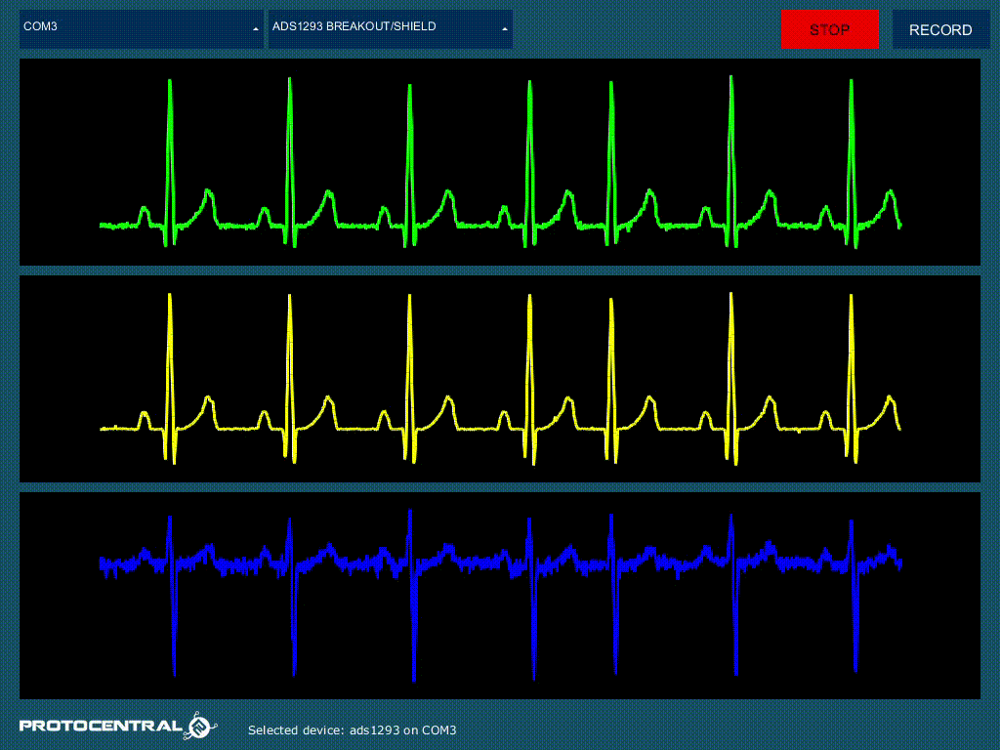

ProtoCentral ADS1293 breakout board
================================

If you don't already have one, you can BUY [ProtoCentral ADS1293 Breakout here.](https://protocentral.com/product/protocentral-ads1293-breakout-board/)

Are you looking for a small ECG board that can read your heart? Well, here it is!!! The ADS1293 breakout board has a capacity of 3 channels and the integration of 4 leads  of the electrical activity of the heart. This is a simple board to connect ECG to your Arduino, Raspberry Pi or any microcontroller you like.

This breakout board for the TI ADS1293 Analog front-end IC comes with with three High-Resolution Digital ECG Channels With Simultaneous PACE Output. 

Features
--------
* ADS1293 Analog Front End IC.
* Three High-Resolution Digital ECG Channels.
* Low Power: 0.3 mW/channel.
* Onboard 3.3V voltage regulator for low noise.
* Onboard logic level translators for Arduino interface.
* Prototyping area for adding additional components.

Includes
--------
* ADS1293 Breakout Board
* 2x Electrode cables with 3.5mm connector
* Pack of disposable stick-on ECG electrodes-20 each

## Wiring to your Arduino

|ADS1293 Pin | Pin Function         |Arduino Uno Pin Connection|
|-----------------|:--------------------:|-----------------:|
| DRDY            | Data ready Output pin|  D2              |             
| MISO            | Slave Out            |  D12             |
| MOSI            | Slave In             |  D11             |
| SCLK            | Serial Clock         |  D13             |
| CS              | Chip Select          |  D10             |
| vcc             | Digital VDD          |  +5V             |
| GND             | Digital Gnd          |  Gnd             |

## Running the Arduino Sketch
If you have correctly installed the libraries, the example sketeches should now be available from within Arduino.
If its not showing, please, [Download the Arduino Sketch from our repository here](https://github.com/Protocentral/protocentral-ads1293-arduino) and place it in the arduino libraries folder.

Open up your Arduino IDE and run the Arudino sketch (.ino) file in the archive that you downloaded. Your Arduino should now be programmed to read the ecg data and sending over the USB-UART.

## Using the ProtoCentral OpenView GUI
The GUI for visualizing the ads1293 data is written in Processing, based on Java and is cross-compilable across platforms.

Java 8 is required on all platforms for running the processing-based GUI application. You can download Java for your platform from the Official Java website.

You can download and install ProtoCentral OpenView from here: https://github.com/Protocentral/protocentral_openview

License Information
===================

This product is open source! Both, our hardware and software are open source and licensed under the following licenses:

Hardware
---------

**All hardware is released under the [CERN-OHL-P v2](https://ohwr.org/cern_ohl_p_v2.txt)** license.

Copyright CERN 2020.

This source describes Open Hardware and is licensed under the CERN-OHL-P v2.

You may redistribute and modify this documentation and make products
using it under the terms of the CERN-OHL-P v2 (https:/cern.ch/cern-ohl).
This documentation is distributed WITHOUT ANY EXPRESS OR IMPLIED
WARRANTY, INCLUDING OF MERCHANTABILITY, SATISFACTORY QUALITY
AND FITNESS FOR A PARTICULAR PURPOSE. Please see the CERN-OHL-P v2
for applicable conditions

Software
--------

**All software is released under the MIT License(http://opensource.org/licenses/MIT).**

THE SOFTWARE IS PROVIDED "AS IS", WITHOUT WARRANTY OF ANY KIND, EXPRESS OR IMPLIED, INCLUDING BUT NOT LIMITED TO THE WARRANTIES OF MERCHANTABILITY, FITNESS FOR A PARTICULAR PURPOSE AND NONINFRINGEMENT. IN NO EVENT SHALL THE AUTHORS OR COPYRIGHT HOLDERS BE LIABLE FOR ANY CLAIM, DAMAGES OR OTHER LIABILITY, WHETHER IN AN ACTION OF CONTRACT, TORT OR OTHERWISE, ARISING FROM, OUT OF OR IN CONNECTION WITH THE SOFTWARE OR THE USE OR OTHER DEALINGS IN THE SOFTWARE.

Documentation
-------------
**All documentation is released under [Creative Commons Share-alike 4.0 International](http://creativecommons.org/licenses/by-sa/4.0/).**

You are free to:

* Share — copy and redistribute the material in any medium or format
* Adapt — remix, transform, and build upon the material for any purpose, even commercially.
The licensor cannot revoke these freedoms as long as you follow the license terms.

Under the following terms:

* Attribution — You must give appropriate credit, provide a link to the license, and indicate if changes were made. You may do so in any reasonable manner, but not in any way that suggests the licensor endorses you or your use.
* ShareAlike — If you remix, transform, or build upon the material, you must distribute your contributions under the same license as the original.

Please check [*LICENSE.md*](LICENSE.md) for detailed license descriptions.
